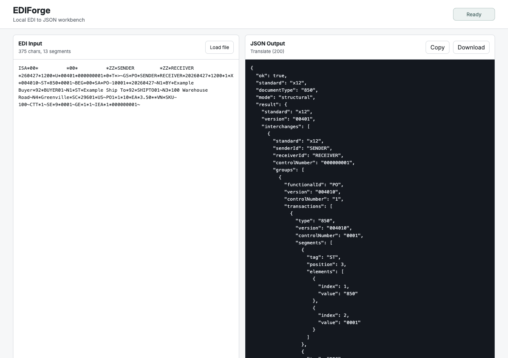

<div align="center">

# EDIForge

**Local-first EDI to JSON translation for X12 and UN/EDIFACT workflows.**

[](https://github.com/johnmonarch/EDIForge/actions/workflows/ci.yml)
[](https://github.com/johnmonarch/EDIForge/actions/workflows/release.yml)
[](https://pkg.go.dev/github.com/johnmonarch/ediforge)
[](https://github.com/johnmonarch/EDIForge/releases)
[](LICENSE)
[](go.mod)
[](https://github.com/johnmonarch/homebrew-tap)

[Install](#install) | [CLI](#cli) | [HTTP API](#http-api) | [Web UI](#web-ui) | [Schemas](#schemas-and-mapping) | [Security](#security)

</div>

EDIForge is a free, open-source translator for turning EDI files into inspectable JSON without sending shipment, order, invoice, or warehouse data to a cloud service. It supports X12 and UN/EDIFACT through one translation engine exposed by a CLI, a local REST API, and an embedded browser UI.

It is built for integration developers, logistics teams, trading-partner onboarding, QA, and internal automation. Use it to inspect envelopes and segments, validate parser output, produce annotated JSON from schemas, and map common business fields into semantic JSON that downstream systems can consume.

## What It Does

| Area | Capability |
| --- | --- |
| EDI detection | Auto-detects X12 and UN/EDIFACT and derives delimiters from ISA or UNA service strings |
| Translation | Converts EDI into structural JSON with envelopes, groups, transactions or messages, segments, elements, and components |
| Output modes | Produces `structural`, `annotated`, and `semantic` JSON from the same parser pipeline |
| Validation | Reports syntax, envelope, control-number, segment-count, schema, and mapping diagnostics with actionable hints |
| Schemas | Ships public-safe starter schemas and mappings for common X12 and EDIFACT messages |
| Interfaces | Runs as a terminal command, localhost HTTP API, embedded web UI, Go package, or containerized service |
| Privacy | Keeps normal workflows local: no telemetry, uploads, or outbound network calls from the translator |

## Install

Build from source:

```bash
git clone https://github.com/johnmonarch/EDIForge.git
cd EDIForge
./scripts/build.sh
```

Run the built CLI:

```bash
./bin/edi-json version
./bin/edi-json translate ./testdata/x12/850-basic.edi --mode structural --pretty
```

Install with Go:

```bash
go install github.com/johnmonarch/ediforge/cmd/edi-json@latest
```

Install with Homebrew:

```bash
brew tap johnmonarch/tap
brew install edi-json
```

Release binaries and container images are published from version tags:

- [GitHub Releases](https://github.com/johnmonarch/EDIForge/releases)
- [Container package](https://github.com/johnmonarch/EDIForge/pkgs/container/ediforge)

## CLI

Detect the standard:

```bash
edi-json detect ./testdata/x12/850-basic.edi --json
```

Translate one file:

```bash
edi-json translate input.edi --standard auto --mode structural --pretty
```

Translate a folder:

```bash
edi-json translate ./incoming --pretty
```

Validate in CI:

```bash
edi-json validate input.edi --level syntax --json
```

Run with a schema-backed semantic mapping:

```bash
edi-json translate input.edi \
  --mode semantic \
  --schema ./schemas/examples/x12-850-basic.json \
  --pretty
```

## Output Modes

| Mode | Use When |
| --- | --- |
| `structural` | You need a faithful parsed representation of the EDI document |
| `annotated` | You want structural JSON enriched with schema labels and descriptions |
| `semantic` | You want business-shaped JSON produced from schema mapping rules |

## HTTP API

Start the local server:

```bash
edi-json serve --host 127.0.0.1 --port 8765
```

Translate EDI:

```bash
curl -s http://127.0.0.1:8765/api/v1/translate \
  -H 'Content-Type: application/json' \
  -d '{
    "input": "ISA*00*          *00*          *ZZ*SENDER         *ZZ*RECEIVER       *260427*1200*U*00401*000000001*0*T*>~GS*PO*SENDER*RECEIVER*20260427*1200*1*X*004010~ST*850*0001~BEG*00*SA*PO-10001**20260427~SE*2*0001~GE*1*1~IEA*1*000000001~",
    "standard": "auto",
    "mode": "structural",
    "options": {
      "pretty": true,
      "includeEnvelope": true
    }
  }'
```

Core endpoints:

| Endpoint | Purpose |
| --- | --- |
| `GET /health` | Runtime health check |
| `GET /api/v1/version` | Build and version metadata |
| `POST /api/v1/detect` | Detect EDI standard and delimiters |
| `POST /api/v1/translate` | Translate EDI to JSON |
| `POST /api/v1/validate` | Validate EDI and return diagnostics |
| `GET /api/v1/schemas` | List registered schemas |
| `POST /api/v1/schemas/validate` | Validate a schema document |
| `POST /api/v1/explain` | Explain parser output and diagnostics |

## Web UI



The embedded UI is served by the same local API:

```bash
edi-json serve --host 127.0.0.1 --port 8765
```

Then open:

```text
http://127.0.0.1:8765
```

The UI supports paste or file-loaded EDI input, structural/annotated/semantic mode selection, optional schema IDs, validation diagnostics, and client-side copy/download of JSON responses. The checked-in static UI lives in `internal/web/dist`; the future React/Vite source scaffold lives in `web/`.

## Schemas And Mapping

Starter schemas live in `schemas/examples/` for common messages:

| Standard | Examples |
| --- | --- |
| X12 | 850, 810, 856, 214, 990, 997, 999 |
| EDIFACT | ORDERS, ORDRSP, DESADV, INVOIC |

The examples are intentionally public-safe. They do not include paid standards text, proprietary implementation-guide content, partner-specific rules, or restricted code lists. Real trading-partner maps should be supplied by users who have the right to use them.

Configuration can be loaded from `~/.edi-json/config.yml` and `./edi-json.yml`:

```yaml
translation:
  defaultMode: annotated
schemas:
  paths:
    - ./schemas
```

## Containers

Build the local container image:

```bash
docker build -f docker/Dockerfile -t ediforge/edi-json .
```

Run the local API and web UI in a container:

```bash
docker run --rm \
  -p 8765:8765 \
  -v "$PWD:/work" \
  ediforge/edi-json serve --host 0.0.0.0 --port 8765
```

The runtime image contains the compiled Go binary and embedded web assets, with no Node.js requirement at runtime. Official images publish to `ghcr.io/johnmonarch/ediforge` from version tags.

## Local-First Privacy

EDIForge is designed to run on your workstation, build server, or private infrastructure.

| Guarantee | Detail |
| --- | --- |
| No telemetry | Normal CLI, API, and web workflows do not report usage |
| No uploads | EDI input stays local unless you explicitly move it elsewhere |
| Local bind default | The server binds to `127.0.0.1` by default |
| Raw data discipline | Raw EDI should not be logged by default |
| Browser-local handling | Web input remains in memory unless copied or downloaded by the user |

## Documentation

| Topic | Link |
| --- | --- |
| Install | [docs/install.md](docs/install.md) |
| Quickstart | [docs/quickstart.md](docs/quickstart.md) |
| CLI | [docs/cli.md](docs/cli.md) |
| REST API | [docs/api.md](docs/api.md) |
| Web UI | [docs/web-ui.md](docs/web-ui.md) |
| Examples | [docs/examples.md](docs/examples.md) |
| Schemas and mapping | [docs/schemas-and-mapping.md](docs/schemas-and-mapping.md) |
| Validation | [docs/validation.md](docs/validation.md) |
| Docker | [docs/docker.md](docs/docker.md) |
| Standards and IP policy | [docs/standards-ip-policy.md](docs/standards-ip-policy.md) |
| Code of Conduct | [CODE_OF_CONDUCT.md](CODE_OF_CONDUCT.md) |

## Contributing

Contributions are welcome. Start with [CONTRIBUTING.md](CONTRIBUTING.md) for local setup, development expectations, and pull request guidance.

Please keep examples, schemas, and fixtures redistributable. Do not contribute paid X12 standards text, restricted implementation-guide content, proprietary partner maps, or data that exposes real trading-party information unless you have explicit rights to share it publicly.

## Security

Report vulnerabilities using the process in [SECURITY.md](SECURITY.md). Avoid opening public issues for sensitive reports.

## License

EDIForge is licensed under the Apache License 2.0. See [LICENSE](LICENSE) and [NOTICE](NOTICE).
